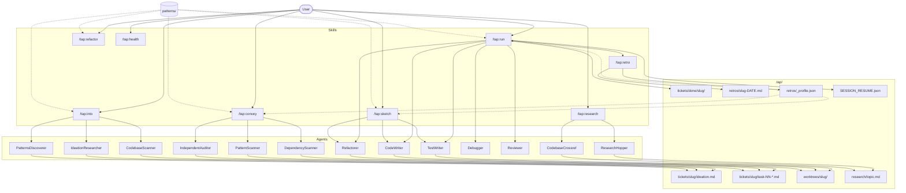

# Architecture

tap is a Claude Code plugin that drives TDD-based development through focused subagents. A feature flows from idea to merged code via a pipeline of skills, each dispatching specialized agents that commit phase-by-phase (RED/GREEN/REFACTOR) with structured trailers. A 97-card design-pattern catalog informs every stage — from ideation through task decomposition to execution and retrospective.

## System Diagram



## Skill to Agent Dispatch

| Skill      | Agents Spawned                                          | Purpose                                                                  |
|------------|---------------------------------------------------------|--------------------------------------------------------------------------|
| `into`     | CodebaseScanner, IdeationResearcher, PatternsDiscoverer | Explore codebase, web, and patterns in parallel; converge on ideation.md |
| `convey`   | DependencyScanner, PatternScanner, IndependentAuditor   | Map deps, identify patterns, audit emitted task files                    |
| `run`      | TestWriter, CodeWriter, Refactorer, Debugger, Reviewer  | Execute TDD phases per task, retry failures, audit final diff            |
| `sketch`   | TestWriter, CodeWriter, Refactorer, Debugger            | Lightweight single-behavior TDD on current branch (no worktree)          |
| `research` | ResearchHopper, CodebaseCrossref                        | Multi-hop web/codebase research with cross-referencing                   |
| `refactor` | (inline — no subagent dispatch)                         | Direct structural refactoring targeting 80% line reduction               |
| `retro`    | (inline — read-only analysis)                           | Parse commit trailers, compute metrics, update rolling profile           |
| `health`   | (inline — diagnostic only)                              | Validate `.tap/` integrity, offer safe repairs                           |

## Artifact Topology

```
.tap/
├── tickets/
│   ├── <slug>/
│   │   ├── ideation.md          # Created by into
│   │   └── task-NN-name.md      # Created by convey (1..N per ticket)
│   └── done/<slug>/             # Moved here after successful run integration
├── worktrees/<slug>/            # Created by run (git worktree); deleted on merge
├── retros/
│   ├── <slug>-YYYY-MM-DD.md    # Ephemeral run report (one per retro)
│   └── _profile.json           # Rolling aggregate — survives across runs
├── research/
│   └── <topic-slug>.md         # Standalone research artifacts
└── SESSION_RESUME.json          # Checkpoint written per wave; deleted on completion
```

**Lifecycle:** `into` creates `ideation.md` → `convey` reads it, emits `task-*.md` files → `run` creates a worktree, executes tasks, merges, moves slug to `done/`, invokes `retro` → `retro` writes report + updates profile. `SESSION_RESUME.json` exists only during an active run for crash recovery.

## Pattern Catalog Integration

The catalog (`patterns/`) contains 97 cards (GoF + Fowler refactorings) with machine-readable frontmatter: `smells_it_fixes`, `test_invariants`, `composes_with`, `clashes_with`.

**Where patterns get queried:**

| Stage                       | What happens                                                                |
|-----------------------------|-----------------------------------------------------------------------------|
| `into` (PatternsDiscoverer) | Scans seed files for structural smells, maps to candidate patterns          |
| `convey` (PatternScanner)   | Reads neighbors of each task's files, attaches pattern hints to GREEN       |
| `run` (TestWriter)          | Reads `test_invariants` from the hint, writes assertions matching them      |
| `run` (CodeWriter)          | Follows the pattern's OOP/FP shape for minimum implementation               |
| `run` (Refactorer)          | Checks `composes_with` for alignment; validates no `clashes_with` violation |
| `sketch`                    | By-smell lookup on target area; shapes RED/GREEN/REFACTOR inline            |
| `refactor`                  | Queries catalog by identified smells before planning reductions             |
| `retro`                     | Cross-references `smells_it_introduces` against failure taxonomy            |

**Flow:** smells observed in code → pattern card matched → `test_invariants` fed to RED → pattern shape guides GREEN → `composes_with`/`clashes_with` validated in REFACTOR → retro correlates pattern use with outcomes → `_profile.json` accumulates signals for future runs.

## Data Flow (End-to-End)

```
idea → /tap:into → ideation.md → /tap:convey → task-01..N.md
     → /tap:run → worktree created → per-task pipeline:
         RED commit (test) → GREEN commit (impl) → REFACTOR commit (cleanup)
     → Reviewer pass → rebase + ff-merge → slug moved to done/
     → /tap:retro → run report + _profile.json updated
```

Each phase commit carries trailers (`Tap-Task`, `Tap-Phase`, `Tap-Files`) that enable retro extraction and session resume. Failed phases get one Debugger retry; persistent failure saga-isolates the task. The profile feeds back into future runs as `profile_note` signals to phase agents.
