# tap:into — RUN_FLOW

Operational source of truth for `/tap:into`. The orchestrator (Claude) reads this top-to-bottom on every invocation and re-reads it before any branch decision. SKILL.md carries triggers and one-line rules; everything procedural lives here.

## Lifecycle

```dot
digraph tap_into {
  rankdir=TB;
  node  [shape=box, fontname="Helvetica"];
  edge  [fontname="Helvetica"];

  start             [label="START", shape=doublecircle];

  /* ── Understanding ── */
  cp_understand     [label="CP:UNDERSTAND\n• dispatch exploration agents\n• websearch + codebase + patterns"];
  cp_synthesis      [label="CP:SYNTHESIS\n• cross-reference agent outputs\n• flag contradictions\n• assumption-audit"];
  design_intent     [label="present design intent\nto engineer", shape=diamond];

  /* ── Ideation ── */
  scope_assess      [label="scope assessment\n• single ticket or decompose?", shape=diamond];
  decomposition     [label="decomposition\n• stub all deferred tickets\n• engineer picks first ticket"];
  cp_approaches     [label="CP:APPROACHES\n• propose 2–5 approaches\n• trade-offs for each"];
  approach_pick     [label="engineer picks\napproach?", shape=diamond];
  fill_sections     [label="fill sections\n• Intent, Context, Approach\n• Signatures, Error design\n• Constraints, Boundaries\n• Open decisions, Considered & rejected\n• Failure modes, Sources"];
  two_impl          [label="two-impl check\n• could two engineers produce\ndifferent implementations?", shape=diamond];
  cp_presentation   [label="CP:PRESENTATION\n• surface design per section\n• architecture, data flow\n• error handling, test cases"];
  design_approve    [label="engineer approves\ndesign?", shape=diamond];

  /* ── Convergence gate ── */
  conv_precheck     [label="convergence pre-check\n(agent — mechanical validation)"];
  conv_result       [label="pre-check pass?", shape=diamond];
  conv_human        [label="human confirm\n(subjective rows)\n• two-impl check\n• synthesis check"];
  conv_human_ok     [label="all confirmed?", shape=diamond];

  /* ── Emission ── */
  emit_ticket       [label="emit ticket to\n.tap/tickets/<slug>/ideation.md"];
  self_review       [label="self-review\n(schema compliance)"];
  review_issues     [label="issues found?", shape=diamond];
  fix_inline        [label="fix inline"];
  eng_review        [label="engineer reviews\nticket", shape=diamond];

  /* ── Handoff + decomposition loop ── */
  convey            [label="handoff\n• surface ideation.md path\n• prompt to read\n• suggest /tap:convey"];
  next_ticket       [label="more stubs\nto ideate?", shape=diamond];

  done              [label="DONE", shape=doublecircle];
  abandoned         [label="ABANDONED\n(engineer cancels)", shape=doublecircle];

  /* ── Edges: Understanding ── */
  start             -> cp_understand;
  cp_understand     -> cp_synthesis;
  cp_synthesis      -> design_intent;
  design_intent     -> scope_assess    [label="approved"];
  design_intent     -> cp_understand   [label="needs more\nexploration"];

  /* ── Edges: Scope ── */
  scope_assess      -> decomposition   [label="too large"];
  scope_assess      -> cp_approaches   [label="right-sized"];
  decomposition     -> cp_approaches   [label="engineer picks\nticket"];

  /* ── Edges: Ideation ── */
  cp_approaches     -> approach_pick;
  approach_pick     -> cp_approaches   [label="reject all /\nmore options"];
  approach_pick     -> fill_sections   [label="picks one"];
  fill_sections     -> two_impl;
  two_impl          -> cp_presentation [label="pass"];
  two_impl          -> fill_sections   [label="fail —\ntighten ambiguity"];
  cp_presentation   -> design_approve;
  design_approve    -> cp_presentation [label="revise\nsections"];
  design_approve    -> cp_approaches   [label="rethink\napproach"];
  design_approve    -> cp_understand   [label="need more\nresearch"];
  design_approve    -> conv_precheck   [label="approved"];

  /* ── Edges: Convergence gate ── */
  conv_precheck     -> conv_result;
  conv_result       -> conv_human      [label="pass"];
  conv_result       -> fill_sections   [label="mechanical\nfailures"];
  conv_human        -> conv_human_ok;
  conv_human_ok     -> emit_ticket     [label="all yes"];
  conv_human_ok     -> cp_synthesis    [label="synthesis\ncheck failed"];
  conv_human_ok     -> cp_approaches   [label="two-impl\ncheck failed"];

  /* ── Edges: Emission ── */
  emit_ticket       -> self_review;
  self_review       -> review_issues;
  review_issues     -> fix_inline      [label="yes"];
  fix_inline        -> self_review;
  review_issues     -> eng_review      [label="no"];
  eng_review        -> fill_sections   [label="changes\nrequested"];
  eng_review        -> convey          [label="approved"];

  /* ── Edges: Decomposition loop ── */
  convey            -> next_ticket     [label="decomposition\nactive"];
  convey            -> done            [label="single ticket /\nlast ticket"];
  next_ticket       -> cp_approaches   [label="yes —\nnext stub"];
  next_ticket       -> done            [label="no"];

  /* ── Abandon: any node can reach ABANDONED (not drawn to avoid clutter) ── */
}
```



## Runbook

1. **Entry.** Engineer invokes `/tap:into` with an idea or feature description. Parse as seed topic for exploration.

2. **CP:UNDERSTAND — Dispatch exploration agents.** Spawn agents in parallel based on complexity:
   - `IdeationResearcher` — web research on topic
   - `CodebaseScanner` — scan codebase for relevant patterns, files, neighbors
   - `PatternsDiscoverer` — pattern scan for conventions and anti-patterns

   Scale agent count to complexity. Simple feature: 1 of each. Complex feature: 2–3 of each with different sub-topics.

3. **CP:SYNTHESIS — Cross-reference and audit.** After all agents return:
   - Cross-reference outputs. Flag contradictions (see Contradiction shapes).
   - For each contradiction, surface to engineer as multi-choice question. Resolve all before proceeding.
   - Run assumption-audit: list every premise the engineer stated. Mark each `verified`, `contradicted`, or `unverifiable`. Surface `contradicted` and `unverifiable` to engineer — force re-evaluation or spike decision.

4. **Design intent.** Present synthesized understanding of what we're building. Wait for engineer's approval. If engineer says "we need more info on X" → loop to CP:UNDERSTAND with refined topics.

5. **Scope assessment.** Evaluate whether the approved design intent fits a single ticket. Scope maps to multiple independent systems → decomposition required.

6. **Decomposition (conditional).** If scope too large:
   - Help engineer decompose into sub-tickets through discussion.
   - Once decomposition confirmed, stub ALL deferred tickets immediately (see Stub format) — every ticket discussed gets a stub on disk, no exceptions.
   - **Stub verification gate.** Run `ls .tap/tickets/` and confirm every decomposed ticket has a directory with a stub `ideation.md`. If any ticket from the decomposition discussion is missing its stub, write it before proceeding. Do not advance to approach selection until the directory listing matches the full decomposition roadmap.
   - Engineer picks which ticket to ideate first (not necessarily lex-first).
   - Flow continues with picked ticket.

7. **CP:APPROACHES — Propose approaches.** Present 2–5 approaches with trade-offs in the format:
   ```
   [{0N}]: <approach title>
     - <approach description>
     - Tradeoffs:
       - <tradeoff one>
       - <tradeoff two>
     - Recommended <approach title>: <why>
   ```
   If `.tap/retros/_profile.json` exists, read `pattern_signals` and surface relevant signals per the [profile contract](${CLAUDE_PLUGIN_ROOT}/skills/retro/profile-contract.md).

8. **Fill sections.** Populate all applicable sections per the [ideation template](ideation-template.md): Intent, Context, Approach (with PATTERN/FLOW/INVARIANTS/SEAMS/OPEN sub-format), Signatures, Error design, Constraints, Boundaries, Open decisions, Considered & rejected, Failure modes, Sources. Do not invent information — gaps stay as gaps until resolved through questions.

9. **Two-impl check.** Ask: could two engineers reading this approach produce two materially different implementations that both satisfy the description? If yes → walk through FLOW step-by-step, identify which step admits multiple valid interpretations. Tighten wording, pin the choice, or surface as `OPEN:` decision. Loop to step 8. Repeat until the approach reads as one implementation, not a family. If no → proceed.

10. **CP:PRESENTATION — Present design.** Surface each section to engineer, scaled by complexity. Propose design patterns from PatternsDiscoverer output. For each section, ask if it looks right. Architecture, components/modules, data flow, error handling, test cases. Go back and forth until convergence.

11. **Convergence gate.** Two-pass gate:
    - **Pass 1 — Agent pre-check (mechanical).** Dispatch ConvergenceChecker (see Dispatch shapes). Flags structural absence only:
      - Flag if `## Approach` is missing `PATTERN:` or value is blank
      - Flag if `## Approach` is missing `FLOW:` or has fewer than 3 numbered steps
      - Flag if `## Approach` is missing `INVARIANTS:` or has zero entries
      - Flag if `## Signatures` is missing and was not marked N/A in conversation
      - Flag if `## Error design` is missing and was not marked N/A in conversation
      - Flag if `## Constraints` has zero bullets
      - Flag if `## Boundaries` has zero bullets
    - Any flags raised → loop to step 8 with specific gaps listed.
    - **Pass 2 — Human confirm (subjective).** Surface to engineer verbatim:
      - [ ] Two-implementations check passed
      - [ ] Synthesis check passed (no unresolved contradictions)
    - Subjective failure routes: two-impl failed → CP:APPROACHES; synthesis failed → CP:SYNTHESIS.

12. **Emit ticket.** Write final ticket to `.tap/tickets/<slug>/ideation.md` following the [ideation template](ideation-template.md).

13. **Self-review.** Validate emitted ticket against template schema. Check: all required sections present, approach block properly formatted (PATTERN/FLOW/INVARIANTS), conditional sections included or intentionally absent, no invented information, code blocks fenced with language tags. Issues found → fix inline, re-validate.

14. **Engineer review.** Surface completed ticket. Approved → proceed. Changes requested → loop to step 8 with engineer's feedback.

15. **Handoff.** Surface emitted ideation path (`.tap/tickets/<slug>/ideation.md`). Prompt engineer to read the file. Suggest running `/tap:convey <slug>` when ready to decompose into tasks. Do not auto-invoke.

16. **Decomposition loop (conditional).** If decomposition produced stubs: ask "continue to next ticket?" If yes → engineer picks next stub, flow resumes at CP:APPROACHES (understanding output carries over). If no → DONE.

## Checkpoints

| Checkpoint | Preserved | Reset |
|---|---|---|
| CP:UNDERSTAND | Engineer's original idea; prior ideation progress if returning from ideation | Agent findings, synthesis conclusions, assumption-audit results |
| CP:SYNTHESIS | Agent findings from exploration | Synthesis conclusions, contradiction resolutions, assumption-audit |
| CP:APPROACHES | All understanding output, scope assessment, decomposition decisions | Approach selection, filled sections, convergence state |
| CP:PRESENTATION | Everything through section fill + two-impl check | Design approval, convergence gate results |

Re-entry at a checkpoint resets everything downstream. Upstream state is preserved.

## Contradiction shapes

Common patterns to watch for during synthesis:

| Shape | Example |
|---|---|
| patterns_discovery recommends X; codebase shows X unused | "Pattern X is best practice" vs "repo uses pattern Y everywhere" |
| websearch recommends approach A; codebase neighbors use approach B | Community consensus vs local convention |
| patterns_discovery flags anti-pattern; engineer's stated approach reproduces it | "This shape is a smell" vs "I want to build exactly this shape" |
| websearch finds library supports feature; codebase pins older version without it | "Library W can do this" vs "our pinned W version can't" |

Surface each as multi-choice: "Sources disagree on {topic}. Source X says {claim X}. Source Y says {claim Y}. Which holds for this feature?"

## Dispatch shapes

### IdeationResearcher

```
Agent(
  subagent_type: "IdeationResearcher",
  description: "Research {topic}",
  prompt: "
    topic: {topic}
    reason: {reason}
    context_seed: <if applicable, brief seed from codebase findings or prior agent output>
  "
)
```

Query construction uses [dorks](${CLAUDE_PLUGIN_ROOT}/dorks.md).

### CodebaseScanner

```
Agent(
  subagent_type: "CodebaseScanner",
  description: "Scan codebase for {topic}",
  prompt: "
    topic: {topic}
    seed_files: <optional, comma-separated paths the conversation already surfaced>
  "
)
```

### PatternsDiscoverer

```
Agent(
  subagent_type: "PatternsDiscoverer",
  description: "Pattern scan for {topic}",
  prompt: "
    topic: {topic}
    seed_files: <comma-separated paths from prior agent output>
    lang: <primary language of the topic area>
  "
)
```

### ConvergenceChecker

```
Agent(
  subagent_type: "Explore",
  description: "Convergence pre-check for {slug}",
  prompt: "
    Read .tap/tickets/{slug}/ideation.md and flag any missing structural
    elements from this checklist:
    1. Flag if ## Approach is missing PATTERN: or value is blank
    2. Flag if ## Approach is missing FLOW: or has fewer than 3 numbered steps
    3. Flag if ## Approach is missing INVARIANTS: or has zero entries
    4. Flag if ## Signatures is missing and was not marked N/A in conversation
    5. Flag if ## Error design is missing and was not marked N/A in conversation
    6. Flag if ## Constraints has zero bullets
    7. Flag if ## Boundaries has zero bullets

    Report: for each row, OK or MISSING with the specific gap.
    Do not evaluate subjective quality — only flag structural absence.
  "
)
```

## Stub format

Used during decomposition to preserve context for deferred tickets:

```markdown
# [<Feature Name>]: Design intent

<!-- TODO: Full ideation pending — run /tap:into to complete -->

## Intent
<one-line description of what this ticket delivers>

## Depends on
- <slug of prerequisite ticket(s)>

## Context (from decomposition)
- <bullet points captured during the scope discussion>
- <relevant findings from the exploration agents>
- <key constraints or decisions that affect this ticket>
```

Intentionally minimal — preserves decomposition context without inventing design decisions. Full ideation happens later via separate `/tap:into` session or decomposition loop.

## Halt paths

| Condition | Action |
|---|---|
| Engineer cancels / abandons / says "stop" | End session. No artifacts emitted. Partial conversation context is not persisted as a draft. |

No loop caps. All loop-backs are infinite — engineer drives pace. Only halt is explicit abandonment.
