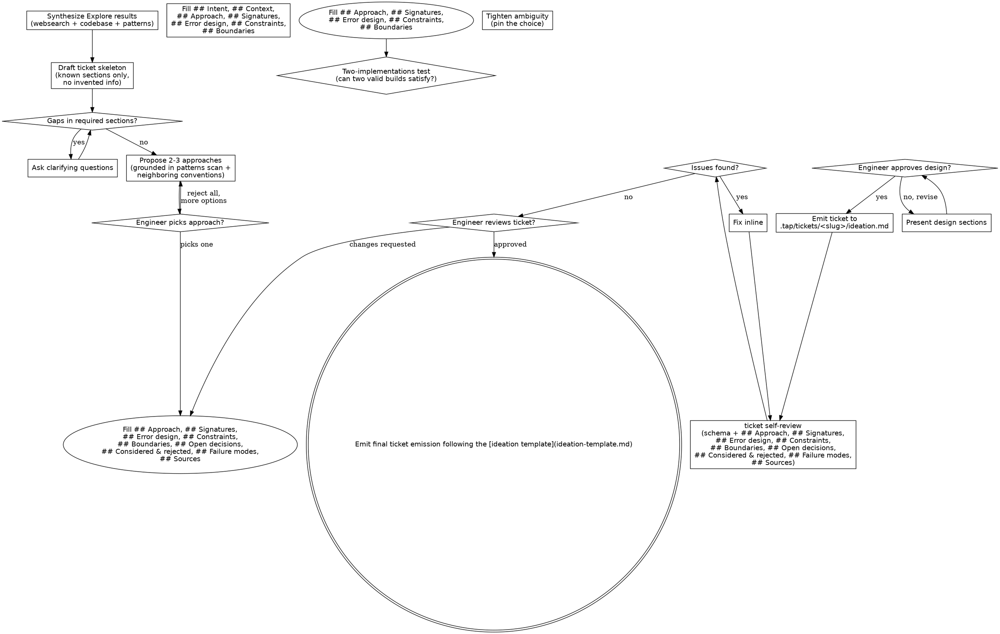

## Phase: understanding

**Purpose:** Understand the current project's context. First, follow the steps, wait for each Agent to finish their explorations, then ask questions to the engineer one at the time to refine the idea provided.

Once you understand what you're building, present the design intent & wait for the engineer's approval before continuing to the Phase: ideation.

You can spawn as many Agents of each of these types as you want: Step: websearch, Step: codebase_exploration & Step: patterns_discovery, depending on the complexity. If for example you need 2 "codebase_exploration" agents, 2 "patterns_discovery" agents & 2 "websearch" agents for a feature, that's fine. It doesn't have to be locked at specifically 3 agents.
Each and everyone of them should be contained to their own tasks:

### Step: websearch

```text
Agent(
  subagent_type: "IdeationResearcher",
  description: "Research {topic}",
  prompt: "
    topic: {topic}
    reason: {reason}
    context_seed: <if applicable, brief seed from codebase findings or prior agent output>
  "
)
```
Query construction uses [dorks](${CLAUDE_PLUGIN_ROOT}/dorks.md).

### Step: codebase_exploration

```text
Agent(
  subagent_type: "CodebaseScanner",
  description: "Scan codebase for {topic}",
  prompt: "
    topic: {topic}
    seed_files: <optional, comma-separated paths the conversation already surfaced>
  "
)
```

### Step: patterns_discovery

```text
Agent(
  subagent_type: "PatternsDiscoverer",
  description: "Pattern scan for {topic}",
  prompt: "
    topic: {topic}
    seed_files: <comma-separated paths from prior agent output>
    lang: <primary language of the topic area>
  "
)
```

### Step: synthesis

After all websearch / codebase_exploration / patterns_discovery agents return, cross-reference their outputs and flag contradictions explicitly. Common contradiction shapes:

- patterns_discovery recommends pattern X; codebase_exploration shows pattern X is not used in repo
- websearch finds community recommends approach A; codebase_exploration shows neighbors use approach B
- patterns_discovery surfaces an anti-pattern in the topic area; the engineer's stated approach reproduces it

For each contradiction, surface to the engineer as a multi-choice question: "Agents disagree on {topic}. Source X says <claim X>, source Y says <claim Y>. Which holds for this feature?" Resolve before moving to Phase: ideation.

If zero contradictions found, state that explicitly and proceed.

### Step: assumption-audit

List every premise the engineer stated during the understanding conversation as a bullet. For each premise, mark one of:
- `verified` — codebase or web findings confirm it
- `contradicted` — findings show it is false (surface to engineer, force re-evaluation)
- `unverifiable` — no source either way (surface to engineer, ask if a quick spike is needed before ideation)

Examples of premises to audit: "X is impossible without Y", "we already use pattern Z", "library W doesn't support this", "the team agreed to constraint C".

Do not skip this step. Bad ideations land on top of unaudited premises.

#### Done

This phase ends when every agent has returned consistent data across all three steps AND Step: synthesis has run (contradictions resolved or explicitly stated as none) AND Step: assumption-audit has run (every premise marked verified / contradicted / unverifiable).

## Phase: ideation

**Purpose**: Deep conversation & collaboration with the engineer to create a ideation.md file that crystallize every decision made.

Based on the findings returned by Step: websearch, Step: codebase_exploration & Step: patterns_discovery, proceed with the ideation by writing a new ticket following the [ideation template](ideation-template.md) at `.tap/tickets/{slug}/ideation.md`. You don't have all the information yet, that is to be expected. The ideation will help filling in the gaps.
Do not invent informations that you don't yet have because false information is worse than no information at all. 

**Critical**: Do no rush convergence, let the engineer drive the conversation but help them along the way. You're thinking partners. The engineer doesn't know what he wants quite yet, the purpose of this phase is to fix that.

### Step: assess

Assess the scope first before asking any questions because if a description maps to multiple independent systems, it will need to be decomposed further. Scope that is too wide is to be decomposed into smaller sub-scope.

### Step: decomposition

If a scope is too large for a single ticket, help the engineer decompose into sub-tickets through the normal Ideation flow. Each scope gets its own ticket & tap run lifecycle.

**Stub deferred tickets immediately.** Once the engineer confirms the decomposition, create a minimal `ideation.md` for each deferred ticket BEFORE diving into the first ticket's full ideation. This ensures nothing falls through the cracks — `ls .tap/tickets/` always shows the full roadmap.

Stub format:
```markdown
# [<Feature Name>]: Design intent

<!-- TODO: Full ideation pending — run /tap-into to complete -->

## Intent
<one-line description of what this ticket delivers>

## Depends on
- <slug of prerequisite ticket(s)>

## Context (from decomposition)
- <bullet points captured during the scope discussion>
- <relevant findings from the exploration agents>
- <key constraints or decisions that affect this ticket>
```

The stub is intentionally minimal — it preserves context from the decomposition discussion without inventing design decisions. The full ideation happens later via a separate `/tap-into` session.

### Step: questioning

Ask questions one at the time. Lead with open, free-form prompts because this phase is a brainstorm, not an interview — the engineer needs latitude to riff, contradict themselves, surface concerns the schema didn't anticipate. Phrase as discussion: "talk me through X", "what's your gut on Y", "where does this break for you", "what would have to be true for Z to work".

Reserve `AskUserQuestion` (multi-choice) for genuine fork-in-road moments where the option set is finite AND the engineer benefits from seeing alternatives laid out:
- Picking among the 2-5 approaches surfaced in Step: approaches
- Resolving a contradiction surfaced in Step: synthesis
- Marking a premise verified / contradicted / unverifiable in Step: assumption-audit

Default to free-form prose questions everywhere else. If a {topic} needs more exploration, break into subsequent free-form questions. Focus on understanding: purpose, constraints, and what "done" should look like.

### Step: approaches

If `.tap/retros/_profile.json` exists, read established `pattern_signals`. When an approach maps to a pattern with profile data, surface the signal per the [profile contract](${CLAUDE_PLUGIN_ROOT}/skills/retro/profile-contract.md).

When exploring {approach}, propose 2-5 different approaches with trade-offs for each.
Present them like the following:
```markdown
  [{0N}]: <approach title>
    - <approach description>
    - Tradeoffs:
      - <tradeoff one>
      - <tradeoff two>
      - <tradeoff n>
    - Recommanded <approach title>: <why>
```

### Step: two-impl-check

After the engineer picks an approach, ask yourself: could two engineers reading this approach produce two materially different implementations that both satisfy the description? If yes, the approach has a hole. Walk through the FLOW step-by-step and identify which step admits multiple valid interpretations. Tighten the wording, pin the choice, or surface as an `OPEN:` decision. Repeat until the approach reads as one implementation, not a family.

### Step: presentation

Once you believe that you understand the design, surface it to the engineer. for each section, scale the explanation based on its complexity and propose design patterns surfaced in Step: patterns_discovery that could match.
For each section, ask if its looks right or not.
Each section should cover architecture, components and/or modules, data flow, how errors are handled and test cases.
This is the step where you have to be ready to go back and forth with the engineer until you've converged.  That's to be expected.

#### Done

Before invoking Next step, run the convergence check. Surface this checklist to the engineer verbatim and require explicit "yes" on each row before emitting the final ticket:

- [ ] `## Approach` — `PATTERN:` named (not blank)
- [ ] `## Approach` — `FLOW:` has ≥3 numbered steps
- [ ] `## Approach` — `INVARIANTS:` has ≥1 entry
- [ ] `## Signatures` — filled OR explicitly marked N/A in the conversation
- [ ] `## Error design` — filled OR explicitly marked N/A in the conversation
- [ ] `## Constraints` — non-empty
- [ ] `## Boundaries` — non-empty
- [ ] Two-implementations check passed (see Step: two-impl-check)
- [ ] Synthesis check passed (see Step: synthesis)

If any row is "no", loop back to the relevant step. Once every row is "yes", proceed to Next step.

## Ideation flow

General flow of the ideation process:


The final state is a fully fledged ticket containing everyting that has been discussed here.

## General rules

These rules apply accross all phases & steps:
  - Always ask one question at a time because more than one question will overwhelm the engineer.
  - Always prefer free-form questions over multi-choice questions because brainstorming needs latitude — a finite option set constrains the conversation before the engineer has surfaced their full thinking. Use multi-choice (`AskUserQuestion`) only when the decision is genuinely binary/finite (approach pick, contradiction resolution, premise audit).
  - Always validate incrementally because this is a slow process. A proper laid out design will produce better result than an poorly laid out one.
  - Always value flexibity because the phases & steps can be interchangeable. Structured ideas will surface from chaos. Going back & forth is expecteed.
  - Always value simplicity over over-engineered ideations because elegance emerge from simple & readable code, not over-engineered code. Good code is not measured by how many lines it contains.

## Next step

Once in this section, immediately invoke Skill(convey, {slug}) where `{slug}` is the ticket slug from the ideation just completed.
