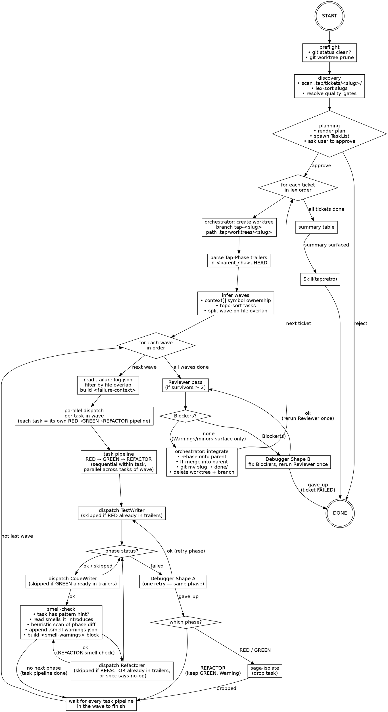

# tap-run — RUN_FLOW

Operational source of truth for `/tap-run`. The orchestrator (Claude) reads this top-to-bottom on every invocation and re-reads it before any branch decision. SKILL.md carries triggers and one-line rules; everything procedural lives here.

## Lifecycle



## Session resume (checkpoint)

Before entering the main runbook, the orchestrator checks for a prior interrupted session.

### Resume detection (runs before step 1)

1. Check if `$REPO_ROOT/.tap/SESSION_RESUME.json` exists.
2. If it does NOT exist → proceed to Runbook step 1 normally.
3. If it exists → read and validate against `schemas/session-resume.schema.json`.
   - Parse error or schema mismatch → WARN, delete the stale file, proceed fresh.
4. Surface the checkpoint to the user:
   ```
   Found interrupted session for ticket "<ticket_slug>".
   Started: <started_at>  |  Last checkpoint: <updated_at>
   Progress: <completed_waves>/<total_waves> waves complete.
   Tasks: <N complete> | <M in_progress> | <P pending>

   Resume from where it stopped, or start fresh?
   ```
5. If user chooses **resume**:
   - Skip Preflight, Discovery, and Planning (steps 1–3).
   - Restore worktree state: verify `active_worktrees` paths still exist. If a worktree is missing, recreate it (`git worktree add`).
   - Build the resume-skip set from checkpoint: tasks with `status: "complete"` are skipped entirely. Tasks with `status: "in_progress"` restart from the phase AFTER `last_phase` (e.g., if `last_phase: "RED"`, resume at GREEN). Tasks with `status: "pending"` run normally.
   - Jump to the first incomplete wave and continue execution from Runbook step 5.
6. If user chooses **fresh start**:
   - Delete `SESSION_RESUME.json`.
   - If `active_worktrees` paths exist, offer to clean them up (`git worktree remove` + branch delete).
   - Proceed to Runbook step 1 normally.

### Checkpoint write (after each wave boundary)

After every wave's `wave_join` completes (all task pipelines in the wave finish or saga-isolate), the orchestrator writes/overwrites `.tap/SESSION_RESUME.json`:

1. Compute current state:
   - `completed_waves` = number of waves where ALL tasks are `complete`, `failed`, or `saga_isolated`.
   - For each task: derive `status` from its TAP_RESULT outcomes and `last_phase` from the last successfully committed phase.
   - `commit_sha` = `git -C <wt> rev-parse --short HEAD` at the time of the task's last commit.
   - `debugger_retries` = accumulated list of Shape A/B outcomes for the session.
2. Write the JSON atomically (write to `.tap/SESSION_RESUME.json.tmp`, then `mv` to `.tap/SESSION_RESUME.json`).
3. `updated_at` = current ISO 8601 timestamp.

### Checkpoint cleanup (after successful completion)

After step 8 (Integrate) succeeds for a ticket:

1. Delete `.tap/SESSION_RESUME.json` if it exists.
2. This ensures completed tickets leave no checkpoint residue.

If all tickets complete successfully (reaching step 10 — Retro), the checkpoint file MUST NOT exist.

## Runbook

1. **Preflight.** `git status --porcelain` on the main repo — must be empty, else halt and surface dirty paths. `git worktree prune` to clear stale entries.
2. **Discovery.** List `.tap/tickets/<slug>/` containing ≥1 `task-*.md` AND no `.tap/tickets/done/<slug>`. Lex-sort slugs. If user passed args (`/tap-run a b`), filter to those slugs in lex order.
3. **Planning.** For each ticket, read every `task-NN-*.md` frontmatter (`id`, `files.create`, `files.modify`, `context[]`); skip bodies. Infer waves (see Wave inference). Render plan (ticket order, per-ticket waves, gate commands; surface any pair forced into a later wave by file overlap). Seed TaskList nested ticket → wave → task → phase via `TaskCreate`; wire cross-wave deps with `TaskUpdate(addBlockedBy=…)`. Present plan and ask engineer to approve. Reject → halt.
4. **Per ticket — open worktree.** `git -C <main> worktree add .tap/worktrees/<slug> -b tap-<slug>`. Capture `parent_sha = git -C <wt> rev-parse --short HEAD`. Set `commit_lock = "$(git -C <wt> rev-parse --absolute-git-dir)/tap-commit.lock"` — resolves the linked worktree's real gitdir (`<main>/.git/worktrees/<slug>/`); never write to `<wt>/.git/...` directly because `<wt>/.git` is a gitdir-pointer file in linked worktrees, not a directory, and `flock` will hit `ENOTDIR` and fall back to creating stray lockfiles in cwd. Parse trailers — `git -C <wt> log <parent_sha>..HEAD --format=%B` — and build the resume-skip set keyed on `(Tap-Task, Tap-Phase)`.
5. **For each wave (in order).**
   - **5a. Failure-context injection.** Before dispatching any phase in this wave, check if `<worktree_path>/.failure-log.json` exists. If so, read and parse it. For each task in the wave, compute the task's file set (`context[].path` ∪ `files.create` ∪ `files.modify`). Filter failure-log entries where any `files_involved[]` path overlaps with the task's file set. If matches exist, build a `<failure-context>` block for that task's agent prompt containing: `task_id` (of the failed task), `phase`, `failure_type`, `root_cause`, `resolution`, and the overlapping files. Include this block in every phase dispatch for that task within this wave.
   - **5b. Dispatch.** Dispatch all RED tasks in ONE assistant message (N parallel `Agent` tool uses, one per task). Join on every `TAP_RESULT`. Then dispatch all GREEN in one message; join. After GREEN joins, run smell-check (step 5c) for every task that just committed GREEN. Then dispatch all REFACTOR in one message (skip per task whose spec declares `## REFACTOR ### Action` no-op or that saga-isolated), injecting any `<smell-warnings>` built in 5c; join. After REFACTOR joins, run smell-check (step 5c) again for every task that just committed REFACTOR — these warnings carry forward to subsequent waves or the Reviewer. Skip any phase whose `(task, phase)` is already in the resume-skip set.
   - **5c. Smell-check (after GREEN or REFACTOR commit).** For each task that just committed a phase with `status: ok` (not skipped or saga-isolated):
     1. Check if the task spec has a `### Pattern hint`. If not, skip this task.
     2. Read the pattern card at `${CLAUDE_PLUGIN_ROOT}/patterns/<category>/<name>.md` and parse `smells_it_introduces` from frontmatter. If empty, skip.
     3. Get the diff of the just-committed phase: `git -C <worktree_path> diff HEAD~1..HEAD`.
     4. For each smell tag in `smells_it_introduces`, apply the heuristic check (see Smell heuristics table below). If the heuristic fires, build a warning entry.
     5. If any warnings were generated, append them to `<worktree_path>/.smell-warnings.json` (create the file if it doesn't exist; read and extend the array if it does).
     6. Before dispatching the NEXT phase agent for this task, read `<worktree_path>/.smell-warnings.json`, filter entries matching this `task_id`, and build a `<smell-warnings>` block for the agent prompt (see format below).
6. **Phase failure handling.** Any `TAP_RESULT.status == "failed"` → dispatch Debugger Shape A once for that task (same phase). On Shape A `ok`, re-dispatch the original phase. On Shape A `gave_up`, branch via the Phase failure branches table.
7. **After all waves.** If survivors ≥ 2, dispatch Reviewer once. On `pass` (or `fail` with only `Warning`/`minor`) → step 8. On `fail` with ≥1 `Blocker`, dispatch Debugger Shape B with the blocker list, then rerun Reviewer ONCE. If Reviewer still returns Blockers → ticket FAILED, leave worktree, advance to next ticket. Survivors < 2 → skip Reviewer.
8. **Integrate.** `git -C <wt> rebase <parent_sha>` onto the main branch's tip; `git -C <main> merge --ff-only tap-<slug>`; `git -C <main> mv .tap/tickets/<slug> .tap/tickets/done/<slug>`; `git -C <main> commit -m "docs: move <slug> to done"`; `git -C <main> merge --ff-only tap-<slug>` again to keep parity; `git -C <main> worktree remove .tap/worktrees/<slug>`; `git -C <main> branch -D tap-<slug>`. Rebase conflict → halt ticket, leave worktree, advance.
9. **Next ticket.** After every ticket: render summary table — per-ticket OK/FAILED/SKIPPED, total commits, elapsed wall time.
10. **Retro.** After the summary table has been surfaced to the user and all commits are final, invoke `Skill(tap:retro)`. This is the last action of the run — nothing follows it.

## Wave inference

1. **Build symbol-owner map.** For each task, walk `context[]`. Entry with `new: true`: match `name` against `files.create` paths in the ticket; owning task = lex-first task whose `files.create` contains a path whose basename / final component matches `name`. No match → symbol is pre-existing, contributes no edge.
2. **Derive task deps.** Task `T` depends on task `U` iff some `T.context[]` entry's owner is `U` and `U ≠ T`. Self-references do not produce edges.
3. **Topo-sort (Kahn).** Wave 0 = tasks with no incoming edges. Wave `n+1` = tasks whose deps are all in waves `≤ n`. Cycle → fatal planning error; surface cycle, halt ticket.
4. **Split on file overlap.** Within each wave, file set per task = `files.create ∪ files.modify`. If two tasks share any path, keep the lex-first task in this wave; push every other overlapping task to the next wave (preserving topo order). Repeat until every wave is pairwise file-disjoint.

Hard rule: two tasks that touch the same file NEVER share a wave.

Worked example — `string-helpers` (4 tasks → 2 waves):

| Task            | `context[]` (new)            | Deps | Wave |
|-----------------|------------------------------|------|------|
| 01-truncate     | `truncate`                   | —    | 0    |
| 02-pad-left     | `padLeft`                    | —    | 0    |
| 03-format-badge | `formatBadge`, `truncate`    | 01   | 1    |
| 04-format-column| `formatColumn`, `padLeft`    | 02   | 1    |

Result: `[[01, 02], [03, 04]]`. Both waves file-disjoint.

## Phase failure branches

| Phase    | Failure mode                                   | Action                                                                  |
|----------|------------------------------------------------|-------------------------------------------------------------------------|
| RED      | `failed` after Shape A `gave_up`               | Saga-isolate task; surface as FAILED in summary; continue wave          |
| GREEN    | `failed` after Shape A `gave_up`               | Saga-isolate task (RED commit reverted by orchestrator); continue wave  |
| REFACTOR | `failed` after Shape A `gave_up`               | Drop only REFACTOR; keep GREEN; surface as Warning; task survives       |
| REFACTOR | `gave_up` directly (op impossible per spec)    | Clean abort; task survives; no Warning; no commit                       |
| any      | Lock acquisition timeout (`flock -w 300` fail) | Treat as `failed` with `phase: "LOCK"`; Shape A retries once; second timeout → saga-isolate |
| any      | Phase agent emits malformed `TAP_RESULT`       | Halt ticket; leave worktree intact; surface agent + parse error         |

## Halt paths

| Condition                                            | Action                                                                |
|------------------------------------------------------|-----------------------------------------------------------------------|
| Dirty main repo on entry                             | Halt before discovery; surface dirty paths                            |
| Quality gates unresolvable                           | Halt before planning                                                  |
| Cycle in symbol-owner graph                          | Halt the ticket pre-worktree; surface the cycle                       |
| Worktree create fails                                | Mark ticket FAILED; advance to next ticket                            |
| Phase agent malformed envelope                       | Halt ticket; leave worktree intact                                    |
| Commit-lock timeout twice (same task / phase)        | Saga-isolate task; continue wave                                      |
| All tasks saga-isolated                              | Skip merge; ticket FAILED; remove worktree; advance                   |
| Reviewer Blockers persist after Shape B              | Ticket FAILED; leave worktree intact; advance                         |
| Rebase conflict on integration                       | Halt ticket; leave worktree intact for inspection                     |

Halt never auto-cleans. Surface exact reason + concrete next user action.

## Dispatch shape

Agent tool template (one call per phase per task):

```
Agent(
  subagent_type: "TestWriter" | "CodeWriter" | "Refactorer" | "Debugger" | "Reviewer",
  description:   "<short>",
  prompt:        "<structured inputs — see below>"
)
```

**Profile-driven calibration.** Before dispatching any phase agent, check if `.tap/retros/_profile.json` exists. If absent, skip calibration — the pipeline runs identically without it. If present, build a `<calibration>` block for each dispatched agent using the protocol below. Only `established` signals (sample_count ≥ 3) get injected. `tentative` signals are logged to the orchestrator's internal state but NEVER included in the `<calibration>` block. See the [profile contract](${CLAUDE_PLUGIN_ROOT}/skills/retro/profile-contract.md) for signal semantics and thresholds.

**Calibration block format.** The `<calibration>` block is structured XML injected into the agent's prompt after the six standard inputs and after `<failure-context>` (if any). Each signal entry is a self-contained element the agent can parse mechanically:

```
<calibration>
  <agent-signal agent="CodeWriter" failure_rate="0.35" tasks="20" top_failure_type="missing-module" />
  <gate-signal gate="tsc" phase="GREEN" failure_rate="0.15" samples="8" />
  <pattern-signal pattern="strategy" clean_green_rate="1.0" samples="5" />
  <token-signal complexity="moderate" avg_tokens="25000" samples="5" />
</calibration>
```

Not every element appears every time. Include only elements where an established signal matches the dispatched agent and current context. Empty `<calibration>` blocks are omitted entirely.

**Signal-to-element mapping:**

| Profile signal | Element | Include when | Content |
|---|---|---|---|
| `agent_performance[agent].failure_rate` | `<agent-signal>` | `failure_rate > 0.3` AND agent matches the dispatched agent | `agent`, `failure_rate`, `tasks`, `top_failure_type` (first entry of `common_failure_types` if available) |
| `gate_signals[gate]` | `<gate-signal>` | `failure_rate > 0.1` AND `phase` matches the dispatched phase | `gate`, `phase`, `failure_rate`, `samples` |
| `pattern_signals[pattern]` | `<pattern-signal>` | task spec carries a `### Pattern hint` naming this pattern | `pattern`, `clean_green_rate`, `adherence_rate`, `samples`. If `smell_correlations` exist, add `smell_tags` (comma-separated) |
| `token_signals.avg_tokens_per_complexity` | `<token-signal>` | task matches a complexity class (simple: ≤2 files, moderate: 3–4 files, complex: 5+ files) | `complexity`, `avg_tokens`, `samples` |

**Per-agent calibration rules.** Each agent type responds to different signals within the `<calibration>` block:

- **TestWriter**: reads `<pattern-signal>` to align test invariants with historically proven structures. Reads `<gate-signal>` for RED-phase gates to prioritize early verification. Ignores `<token-signal>`.
- **CodeWriter**: reads `<pattern-signal>` to calibrate confidence — high `clean_green_rate` (≥ 0.8) means proceed with confidence; low `clean_green_rate` (< 0.5) means add an extra verification pass after writing code. Reads `<agent-signal>` (own) to self-adjust on historical failure areas. Reads `<gate-signal>` for GREEN-phase gates — run high-failure gates FIRST. Reads `<token-signal>` to gauge expected effort — simple tasks should not over-engineer.
- **Refactorer**: reads `<pattern-signal>` to check `adherence_rate` and `smell_tags` — low adherence or correlated smells mean extra behavioral-preservation verification before committing. Reads `<agent-signal>` (own) to identify historical failure tendencies. Reads `<gate-signal>` for REFACTOR-phase gates. Ignores `<token-signal>`.

**Calibration is informational augmentation, not behavioral override.** Agents still follow their core phases unchanged. Calibration adjusts verification intensity and ordering — never approach or architecture.

**Failure-context enrichment.** Before dispatching any phase agent, check if `<worktree_path>/.failure-log.json` exists. If so, read and parse it as a JSON array of failure entries (see [failure log schema](${CLAUDE_PLUGIN_ROOT}/schemas/failure-log.schema.md)). For the current task, compute the file set: all `context[].path` values ∪ `files.create` ∪ `files.modify` from the task spec frontmatter. Filter failure-log entries whose `files_involved[]` shares at least one path with the task's file set. If matches exist, build a `<failure-context>` block and include it in the agent's prompt:

```
<failure-context>
Prior failure in this run touching files you are about to work with:
- task: 01-truncate | phase: GREEN | type: missing-module
  root_cause: truncate module not exported from barrel file
  resolution: added truncate to barrel exports
  overlapping_files: src/helpers/index.ts
</failure-context>
```

Include one `- task: ...` stanza per matching entry. Multiple entries are valid. The block goes after the six standard inputs. `<calibration>` (if any) follows `<failure-context>`.

Six structured inputs every phase agent receives:

- `task_file_path` — absolute path to `task-NN-*.md`
- `worktree_path` — absolute path to ticket worktree
- `quality_gates` — JSON array of shell commands
- `ticket_slug` — slug of parent ticket
- `parent_sha` — short SHA of pre-task ticket-branch base
- `commit_lock` — absolute path to the worktree's commit lockfile, resolved via `git -C <wt> rev-parse --absolute-git-dir` and suffixed with `/tap-commit.lock`. Lives inside `<main>/.git/worktrees/<slug>/` (never tracked, never in working tree).

**Wave-parallel batching.** ONE assistant message contains N `Agent` tool uses for the N tasks of the wave's current phase. Three batches per wave (RED, GREEN, REFACTOR), each followed by a join. Sibling pipelines never ship dispatches across separate messages.

**Per-shape extras.** Reviewer takes the same six (parent_sha is already standard). Debugger Shape A: `failed_phase` tag + `failure_stderr`. Debugger Shape B: `blocker_list` (Reviewer's `issues[]` filtered to `severity == "Blocker"`).

**TAP_RESULT envelope.** Each agent emits a final-line `TAP_RESULT: {...}` JSON. Orchestrator parses `status` (`ok` | `failed` | `gave_up` for phase agents; `pass` | `fail` for Reviewer) and branches per the runbook + Phase failure branches table. Missing / malformed / non-final envelope → halt ticket.

## Smell-introduction detection

After each GREEN or REFACTOR commit lands, the orchestrator checks whether the applied pattern's known trade-offs have manifested in the diff. This is a heuristic scan — false positives are acceptable; agents dismiss irrelevant warnings. The Refactorer is the primary consumer; CodeWriter receives warnings as informational context only.

### Smell heuristics table

Each heuristic receives the output of `git -C <worktree_path> diff HEAD~1..HEAD` and answers a yes/no question. When the answer is yes, the orchestrator records the smell tag, the evidence description, and the files involved.

| Smell tag | Heuristic | Evidence description |
|-----------|-----------|---------------------|
| `over-abstraction-single-variant` | Diff adds an interface/abstract-class/trait/protocol AND only one concrete implementation of it | "interface X introduced with only one implementing class Y" |
| `speculative-generality` | Diff adds a class/function/type that is not referenced by any test or call site in the diff itself | "symbol X defined but not exercised by any test or caller in this diff" |
| `god-class` | A single file in the diff gains 5+ new method/function definitions | "file X gains N new methods in this commit" |
| `feature-envy` | New code in file A imports 3+ symbols from a single other module B and uses them heavily (more references to B's symbols than to A's own) | "file A references N symbols from module B, suggesting feature envy" |
| `shotgun-surgery` | The same small change pattern (same identifier rename, same parameter addition, same import) appears across 4+ files | "change pattern 'X' scattered across N files" |
| `temporal-coupling` | Diff introduces ordered method calls (e.g., `init()` before `execute()`, `open()` before `read()`) with no structural enforcement (no builder, no state machine) | "methods X and Y require ordered invocation with no compile-time enforcement" |
| `inappropriate-intimacy` | New code directly accesses another class's private/internal fields or reaches through 2+ levels of object navigation (e.g., `a.b.c.doThing()`) | "code in X reaches into internals of Y via chained access" |
| `mutable-shared-state` | Diff introduces a module-level or static mutable variable accessed from multiple functions | "mutable shared variable X defined at module scope and accessed by N functions" |
| `parallel-inheritance-hierarchy` | Diff adds 2+ new class/interface declarations that mirror an existing hierarchy (similar naming pattern, one-to-one correspondence) | "new classes X, Y mirror existing hierarchy A, B" |
| `large-class` | A single file in the diff exceeds 300 net new lines | "file X adds N new lines in a single commit" |

For smell tags not listed above: skip the check silently. The table covers the most common pattern-introduced smells; exotic tags pass through undetected rather than producing false heuristics.

### `<smell-warnings>` block format

Injected into the agent prompt after `<failure-context>` (if any) and before `<calibration>` (if any):

```
<smell-warnings>
Pattern "strategy" applied in GREEN may have introduced these smells:
- smell: over-abstraction-single-variant
  evidence: interface DiscountStrategy introduced with only one implementing class FlatDiscount
  files: src/discount/strategy.ts, src/discount/flat-discount.ts
- smell: speculative-generality
  evidence: symbol DiscountRegistry defined but not exercised by any test or caller in this diff
  files: src/discount/registry.ts
</smell-warnings>
```

Include one `- smell: ...` stanza per warning entry. Multiple entries from different phases are valid. The `phase_that_introduced` field is implicit from the header text ("applied in GREEN" vs "applied in REFACTOR").

## Commit policy

- **Subjects (exact prefixes).**
  - `test(<task-id>): <subject>` — TestWriter
  - `feat(<task-id>): <subject>` — CodeWriter
  - `refactor(<task-id>): <subject>` — Refactorer
  - `fix(<scope>): <subject>` — Debugger (scope = task-id Shape A, module name Shape B)
- **Trailers (mandatory on every phase commit).** `Tap-Task: <task-id>` (or `Tap-Task: reviewer` for Shape-B debug); `Tap-Phase: RED|GREEN|REFACTOR|DEBUG`; `Tap-Files: <comma-paths>`. Debugger adds `Tap-Decisions: <one-line root cause + fix shape>`.
- **Gate exemption.** RED may leave the test gate red; `tsc` / `lint` / `build` MUST pass. GREEN, REFACTOR, and DEBUG (Shape A GREEN/REFACTOR-recovery, all Shape B) require all four gates green.
- **Concurrency.** Lint and tsc are read-only — may run pre-lock. Build and test write to disk — MUST run under `flock -w 300 <commit_lock> -- <gate>`. The `git add … && git commit …` pair MUST run under the same lock. Lock-acquisition cap: 5 min.
- **REFACTOR no-op.** When the spec's `## REFACTOR ### Action` declares no-op, Refactorer skips entirely — no commit at all. Surface as `skipped` in the TaskList.
- **Hooks.** Never `--no-verify`, never `--no-gpg-sign`, never `--amend`. Hook failure → fix the underlying issue and create a NEW commit.
