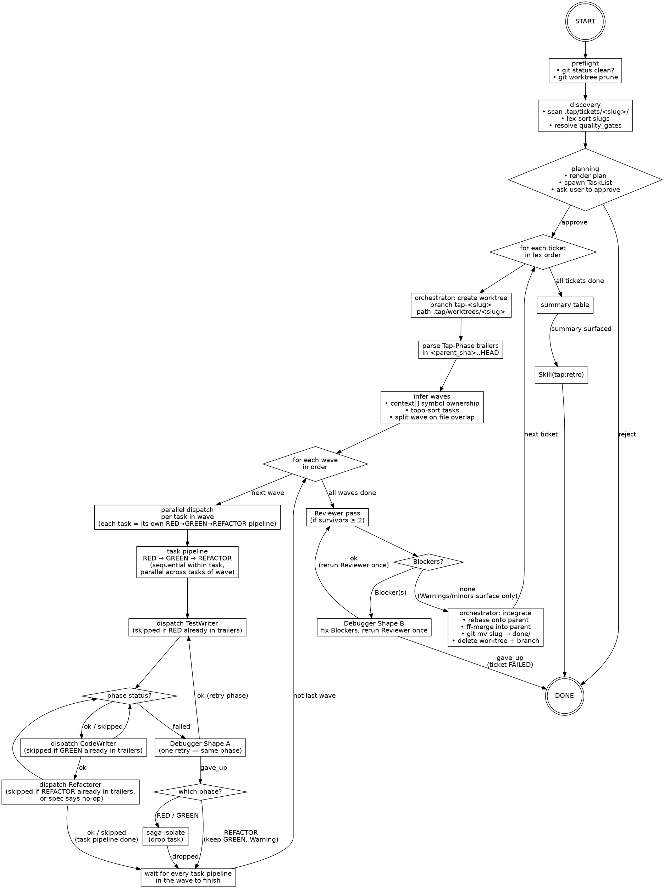

# tap-run — RUN_FLOW

Operational source of truth for `/tap-run`. The orchestrator (Claude) reads this top-to-bottom on every invocation and re-reads it before any branch decision. SKILL.md carries triggers and one-line rules; everything procedural lives here.

## Lifecycle



## Runbook

1. **Preflight.** `git status --porcelain` on the main repo — must be empty, else halt and surface dirty paths. `git worktree prune` to clear stale entries.
2. **Discovery.** List `.tap/tickets/<slug>/` containing ≥1 `task-*.md` AND no `.tap/tickets/done/<slug>`. Lex-sort slugs. If user passed args (`/tap-run a b`), filter to those slugs in lex order.
3. **Planning.** For each ticket, read every `task-NN-*.md` frontmatter (`id`, `files.create`, `files.modify`, `context[]`); skip bodies. Infer waves (see Wave inference). Render plan (ticket order, per-ticket waves, gate commands; surface any pair forced into a later wave by file overlap). Seed TaskList nested ticket → wave → task → phase via `TaskCreate`; wire cross-wave deps with `TaskUpdate(addBlockedBy=…)`. `AskUserQuestion` to approve. Reject → halt.
4. **Per ticket — open worktree.** `git -C <main> worktree add .tap/worktrees/<slug> -b tap-<slug>`. Capture `parent_sha = git -C <wt> rev-parse --short HEAD`. Set `commit_lock = "$(git -C <wt> rev-parse --absolute-git-dir)/tap-commit.lock"` — resolves the linked worktree's real gitdir (`<main>/.git/worktrees/<slug>/`); never write to `<wt>/.git/...` directly because `<wt>/.git` is a gitdir-pointer file in linked worktrees, not a directory, and `flock` will hit `ENOTDIR` and fall back to creating stray lockfiles in cwd. Parse trailers — `git -C <wt> log <parent_sha>..HEAD --format=%B` — and build the resume-skip set keyed on `(Tap-Task, Tap-Phase)`.
5. **For each wave (in order).** Dispatch all RED tasks in ONE assistant message (N parallel `Agent` tool uses, one per task). Join on every `TAP_RESULT`. Then dispatch all GREEN in one message; join. Then dispatch all REFACTOR in one message (skip per task whose spec declares `## REFACTOR ### Action` no-op or that saga-isolated); join. Skip any phase whose `(task, phase)` is already in the resume-skip set.
6. **Phase failure handling.** Any `TAP_RESULT.status == "failed"` → dispatch Debugger Shape A once for that task (same phase). On Shape A `ok`, re-dispatch the original phase. On Shape A `gave_up`, branch via the Phase failure branches table.
7. **After all waves.** If survivors ≥ 2, dispatch Reviewer once. On `pass` (or `fail` with only `Warning`/`minor`) → step 8. On `fail` with ≥1 `Blocker`, dispatch Debugger Shape B with the blocker list, then rerun Reviewer ONCE. If Reviewer still returns Blockers → ticket FAILED, leave worktree, advance to next ticket. Survivors < 2 → skip Reviewer.
8. **Integrate.** `git -C <wt> rebase <parent_sha>` onto the main branch's tip; `git -C <main> merge --ff-only tap-<slug>`; `git -C <main> mv .tap/tickets/<slug> .tap/tickets/done/<slug>`; `git -C <main> commit -m "docs: move <slug> to done"`; `git -C <main> merge --ff-only tap-<slug>` again to keep parity; `git -C <main> worktree remove .tap/worktrees/<slug>`; `git -C <main> branch -D tap-<slug>`. Rebase conflict → halt ticket, leave worktree, advance.
9. **Next ticket.** After every ticket: render summary table — per-ticket OK/FAILED/SKIPPED, total commits, elapsed wall time.
10. **Retro.** After the summary table has been surfaced to the user and all commits are final, invoke `Skill(tap:retro)`. This is the last action of the run — nothing follows it.

## Wave inference

1. **Build symbol-owner map.** For each task, walk `context[]`. Entry with `new: true`: match `name` against `files.create` paths in the ticket; owning task = lex-first task whose `files.create` contains a path whose basename / final component matches `name`. No match → symbol is pre-existing, contributes no edge.
2. **Derive task deps.** Task `T` depends on task `U` iff some `T.context[]` entry's owner is `U` and `U ≠ T`. Self-references do not produce edges.
3. **Topo-sort (Kahn).** Wave 0 = tasks with no incoming edges. Wave `n+1` = tasks whose deps are all in waves `≤ n`. Cycle → fatal planning error; surface cycle, halt ticket.
4. **Split on file overlap.** Within each wave, file set per task = `files.create ∪ files.modify`. If two tasks share any path, keep the lex-first task in this wave; push every other overlapping task to the next wave (preserving topo order). Repeat until every wave is pairwise file-disjoint.

Hard rule: two tasks that touch the same file NEVER share a wave.

Worked example — `string-helpers` (4 tasks → 2 waves):

| Task            | `context[]` (new)            | Deps | Wave |
|-----------------|------------------------------|------|------|
| 01-truncate     | `truncate`                   | —    | 0    |
| 02-pad-left     | `padLeft`                    | —    | 0    |
| 03-format-badge | `formatBadge`, `truncate`    | 01   | 1    |
| 04-format-column| `formatColumn`, `padLeft`    | 02   | 1    |

Result: `[[01, 02], [03, 04]]`. Both waves file-disjoint.

## Phase failure branches

| Phase    | Failure mode                                   | Action                                                                  |
|----------|------------------------------------------------|-------------------------------------------------------------------------|
| RED      | `failed` after Shape A `gave_up`               | Saga-isolate task; surface as FAILED in summary; continue wave          |
| GREEN    | `failed` after Shape A `gave_up`               | Saga-isolate task (RED commit reverted by orchestrator); continue wave  |
| REFACTOR | `failed` after Shape A `gave_up`               | Drop only REFACTOR; keep GREEN; surface as Warning; task survives       |
| REFACTOR | `gave_up` directly (op impossible per spec)    | Clean abort; task survives; no Warning; no commit                       |
| any      | Lock acquisition timeout (`flock -w 300` fail) | Treat as `failed` with `phase: "LOCK"`; Shape A retries once; second timeout → saga-isolate |
| any      | Phase agent emits malformed `TAP_RESULT`       | Halt ticket; leave worktree intact; surface agent + parse error         |

## Halt paths

| Condition                                            | Action                                                                |
|------------------------------------------------------|-----------------------------------------------------------------------|
| Dirty main repo on entry                             | Halt before discovery; surface dirty paths                            |
| Quality gates unresolvable                           | Halt before planning                                                  |
| Cycle in symbol-owner graph                          | Halt the ticket pre-worktree; surface the cycle                       |
| Worktree create fails                                | Mark ticket FAILED; advance to next ticket                            |
| Phase agent malformed envelope                       | Halt ticket; leave worktree intact                                    |
| Commit-lock timeout twice (same task / phase)        | Saga-isolate task; continue wave                                      |
| All tasks saga-isolated                              | Skip merge; ticket FAILED; remove worktree; advance                   |
| Reviewer Blockers persist after Shape B              | Ticket FAILED; leave worktree intact; advance                         |
| Rebase conflict on integration                       | Halt ticket; leave worktree intact for inspection                     |

Halt never auto-cleans. Surface exact reason + concrete next user action.

## Dispatch shape

Agent tool template (one call per phase per task):

```
Agent(
  subagent_type: "TestWriter" | "CodeWriter" | "Refactorer" | "Debugger" | "Reviewer",
  description:   "<short>",
  prompt:        "<structured inputs — see below>"
)
```

**Profile enrichment.** Before dispatching any phase agent, check if `.tap/retros/_profile.json` exists. If so, read established `agent_performance` and `gate_signals` entries relevant to the dispatched agent and phase. Include matching signals as a `profile_note` line in the agent's prompt. See the [profile contract](${CLAUDE_PLUGIN_ROOT}/skills/retro/profile-contract.md) for signal semantics and thresholds.

Six structured inputs every phase agent receives:

- `task_file_path` — absolute path to `task-NN-*.md`
- `worktree_path` — absolute path to ticket worktree
- `quality_gates` — JSON array of shell commands
- `ticket_slug` — slug of parent ticket
- `parent_sha` — short SHA of pre-task ticket-branch base
- `commit_lock` — absolute path to the worktree's commit lockfile, resolved via `git -C <wt> rev-parse --absolute-git-dir` and suffixed with `/tap-commit.lock`. Lives inside `<main>/.git/worktrees/<slug>/` (never tracked, never in working tree).

**Wave-parallel batching.** ONE assistant message contains N `Agent` tool uses for the N tasks of the wave's current phase. Three batches per wave (RED, GREEN, REFACTOR), each followed by a join. Sibling pipelines never ship dispatches across separate messages.

**Per-shape extras.** Reviewer takes the same six (parent_sha is already standard). Debugger Shape A: `failed_phase` tag + `failure_stderr`. Debugger Shape B: `blocker_list` (Reviewer's `issues[]` filtered to `severity == "Blocker"`).

**TAP_RESULT envelope.** Each agent emits a final-line `TAP_RESULT: {...}` JSON. Orchestrator parses `status` (`ok` | `failed` | `gave_up` for phase agents; `pass` | `fail` for Reviewer) and branches per the runbook + Phase failure branches table. Missing / malformed / non-final envelope → halt ticket.

## Commit policy

- **Subjects (exact prefixes).**
  - `test(<task-id>): <subject>` — TestWriter
  - `feat(<task-id>): <subject>` — CodeWriter
  - `refactor(<task-id>): <subject>` — Refactorer
  - `fix(<scope>): <subject>` — Debugger (scope = task-id Shape A, module name Shape B)
- **Trailers (mandatory on every phase commit).** `Tap-Task: <task-id>` (or `Tap-Task: reviewer` for Shape-B debug); `Tap-Phase: RED|GREEN|REFACTOR|DEBUG`; `Tap-Files: <comma-paths>`. Debugger adds `Tap-Decisions: <one-line root cause + fix shape>`.
- **Gate exemption.** RED may leave the test gate red; `tsc` / `lint` / `build` MUST pass. GREEN, REFACTOR, and DEBUG (Shape A GREEN/REFACTOR-recovery, all Shape B) require all four gates green.
- **Concurrency.** Lint and tsc are read-only — may run pre-lock. Build and test write to disk — MUST run under `flock -w 300 <commit_lock> -- <gate>`. The `git add … && git commit …` pair MUST run under the same lock. Lock-acquisition cap: 5 min.
- **REFACTOR no-op.** When the spec's `## REFACTOR ### Action` declares no-op, Refactorer skips entirely — no commit at all. Surface as `skipped` in the TaskList.
- **Hooks.** Never `--no-verify`, never `--no-gpg-sign`, never `--amend`. Hook failure → fix the underlying issue and create a NEW commit.
